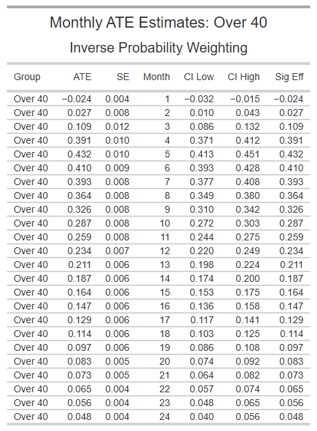

```{r setup, include=FALSE}
knitr::opts_chunk$set(
	echo = FALSE,   # Hides code
	message = FALSE,
	warning = FALSE,
	fig.align = "center",  # Optional: center figures
	out.width = "80%",      # Optional: scale figure size for space
	fig.height = 3,
	fig.width = 6
	)
```

```{r message=FALSE, warning=FALSE, include=FALSE}
# Define packages that you need
packages_vector <- c("tidyverse",    # package collection for data management 
                      "dplyr",       # set of functions to work with data 
                      "foreign",     # loading data (e.g. data from old Stata versions)
                      "haven",       # loading data (e.g. data from newer Stata versions)
                      "knitr",       # integrates computing and reporting
                      "fastDummies", # dummy creation
                      "sandwich",    # robust standard errors
                      "lmtest",      # robust standard errors
                      "jtools",      # summary statistics (robust standard errors)
                      "fBasics",     # summary statistics
                      "arsenal",     # summary statistics
                      "data.table",  # tables
                      "stargazer",   # tables
                      "xtable",      # tables
                      "expss",       # tables, labels 
                      "sjlabelled",  # labels
                      "lubridate",   # dates
                      "mfx",         # marginal effects for nonlinear models, e.g. probit 
                      "ggplot2",
                     "causalweight",
                     "gt",
                     "patchwork",
                     "flextable")     # plots and graphs 
                     
# Uncomment the following line the first time you use these packages to install them
# install.packages(packages_vector)
lapply(packages_vector, require, character.only = TRUE) 
```


```{r include=FALSE}
# Loading given dataset
load("G:/My Drive/SwissTPH/Spring2025ClassesBasel/CausalInferencePolicyEvaluation/04_Small_Assignments/Assignment_1/Assignment_1.RData")
```

```{r}
#glimpse(raw.data)
```

## Question 1

```{r include=FALSE}
# Creating a dummy variable indicating if someone is under 40 years old

# Getting an idea of current variables
raw.data[c("agegr_2", "agegr_3", "agegr_4")] %>% head()

# Seeing if there are rows with 0s for each dummy
raw.data[c("agegr_2", "agegr_3", "agegr_4")] %>% rowSums()

# Finding rows which correspond to those under 40 (note all those under 18 and above 60 were dropped)
raw.data$under_40yo <- ifelse(rowSums(raw.data[c("agegr_3", "agegr_4")]) == 0, 1, 0)

# Getting an idea of current variables
raw.data[c("agegr_2", "agegr_3", "agegr_4", "under_40yo")] %>% head()
```

```{r}
# Examining the balance of this dummy variable across treatment groups
#cro(raw.data$treat, raw.data$under_40yo)
#cro_cpct_responses(raw.data$under_40yo, raw.data$treat)
#cro_cpct_responses(raw.data$treat, raw.data$under_40yo)
```

```{r}
attach(raw.data)
```


```{r}
# Calculating the standardize bias and difference in means

# a selection of controls
x_desc <- cbind(under_40yo)
x_desc_names <- colnames(x_desc)

# Define a function estimating the differences in variables across D
balance_check.model <- function(x){
  
  # Conditional means
  mean_d0 <- mean(x[treat==0])
  mean_d1 <- mean(x[treat==1])
  
  # Variances in subsamples
  var_d0 <- var(x[treat==0])
  var_d1 <- var(x[treat==1])
  
  # Difference in means
  diff_d <- lm(x ~ treat)
  cov <- vcovHC(diff_d, type = "HC")
  robust.se <- sqrt(diag(cov))
  
  # Absolute standardized bias (difference in means over average std dev - assuming similar size of the groups)
  sb <- abs((mean_d1-mean_d0)/sqrt((var_d0+var_d1)/2))*100
  
  # Store output as a list 
  list(mean_d0 = mean_d0, 
       mean_d1 = mean_d1,
       diff_d = diff_d$coefficients[2], 
       robust.se = robust.se[2], 
       pval = 2*pnorm(-abs(diff_d$coefficients[2]/robust.se[2])),
       SB = sb)             
}

# Apply to selection of covariates (MARGIN = 2 to loop over columns)
diff_output <- apply(X = x_desc, MARGIN = 2, FUN = balance_check.model)
# Convert output in list format into a data frame 
diff_output<-as.data.frame(rbindlist(diff_output))

# Add number of observations (don't forget the comma!)
raw.data$treat <- as.vector(raw.data$treat)
obs <- c(nrow(raw.data[raw.data$treat==0,]), 
         nrow(raw.data[raw.data$treat==1,]), 
         NA, NA, NA, NA)
diff_output <- rbind(diff_output, obs)

# Display in desired format
rownames(diff_output)<- c(x_desc_names, "Observations")
colnames(diff_output)<- c("E(X|D=0)", "E(X|D=1)", "Difference", "s.e.", 
                          "p-value", "Abs. SB")
print("Difference in means by treatment status and standardized bias")
print(round(diff_output,digits = 3))
```

The dummy variable under_40yo seems well balanced between treatment and control groups, with low standardized bias (2.6%) and an insignificant difference in means at the 5% significance level.

We should still account for age differences in our analysis due to:

1. Heterogeneity: Age might moderate treatment effects (e.g., younger vs older participants respond differently), so including it enables subgroup or interaction analysis. 

2. Robustness: Including covariates that are predictors of the outcome of interest protects against chance imbalances or unobserved heterogeneity in smaller subgroups.

3. Improved precision: if age group is a good predictor of employment status, then including it in the analysis will lead to a decrease mean squared error, leading to smaller standard errors for the ATE estimate. 


## Question 2
### (a) see R script

```{r}
# Set the horizon
maxdur <- 24

# Create a matrix with n rows and 24 columns
emp <- matrix(0, nrow = nrow(raw.data), ncol = maxdur)

# Create column names like emp_1 to emp_24
emp_list <- paste("emp", 1:maxdur, sep = "_")
colnames(emp) <- emp_list

# Fill in the matrix
for (i in 1:maxdur) {
  emp[, i] <- ifelse(
    raw.data$date_end < raw.data$date_start + 30 * i,
    1,  # employed in month i
    0   # still unemployed in month i
  )
}

# Convert to data frame and combine with original data
emp <- as.data.frame(emp)
raw.data <- cbind(raw.data, emp)

```


```{r include=FALSE}
# Create the outcome variable - "monthly employment probability"

raw.data[c("id", "idobs", "date_start", "date_end", "treat", paste0("emp_", 1:24))] %>% head()
raw.data$month_employ_prob <- raw.data %>% dplyr::select(paste0("emp_", 1:24)) %>% rowMeans()
```


```{r include=FALSE}
# Inspect distribution of monthly employment probability (for each spell)
hist(raw.data$month_employ_prob, main = "Monthly Employment Probability", xlab = "Probability")
hist(subset(raw.data$month_employ_prob, treat == 0), main = "Monthly Employment Probability - Untreated", xlab = "Probability")
hist(subset(raw.data$month_employ_prob, treat == 1), main = "Monthly Employment Probability - Treated", xlab = "Probability")
```

```{r include=FALSE}
# Sanity check for employment duration length
raw.data$duration <- raw.data$date_end - raw.data$date_start
hist(as.numeric(raw.data$duration), xlab = "days", main = "Length of Unemployment Spells")
hist(subset(as.numeric(raw.data$duration), treat == 0), xlab = "days", main = "Length of Unemployment Spells - Untreated")
hist(subset(as.numeric(raw.data$duration), treat == 1), xlab = "days", main = "Length of Unemployment Spells - Treated")
```


### (b)  see R script

```{r}
# Splitting data into under 40 years old and over 40 years old
data_u40 <- raw.data %>% filter(under_40yo == 1)
data_o40 <- raw.data %>% filter(under_40yo == 0)

treat_u40 <- data_u40$treat
treat_o40 <- data_o40$treat

x_u40 <- as.matrix(dplyr::select(data_u40, 
                              covs))
x_o40 <- as.matrix(dplyr::select(data_o40, 
                              covs))
x_names <- colnames(x_u40)

```


```{r include=FALSE}
# Estimate the p-score model for under 40
pscore.model_u40 <- glm(treat_u40 ~ x_u40, family = binomial(link = "probit"))
summ(pscore.model_u40, robust = "HC1")

# Estimate the p-score model for over 40
pscore.model_o40 <- glm(treat_o40 ~ x_o40, family = binomial(link = "probit"))
summ(pscore.model_o40, robust = "HC1")
```

```{r include=FALSE}
data_u40$pscore <- pscore.model_u40$fitted.values 
summary(data_u40$pscore)

data_o40$pscore <- pscore.model_o40$fitted.values 
summary(data_o40$pscore)

```

```{r include=FALSE}
# Create a factor variable for treatment status for the plot
data_u40$treat_f <- factor(treat_u40, 
                           levels = c(0,1), 
                           label = c("D=0", "D=1")) 

# Density plot for the propensity score by treatment status
p_plot1 <- ggplot(data_u40, aes(x = pscore, fill = treat_f)) + 
    geom_density(alpha=0.4) + 
    scale_fill_grey()+ 
    theme_bw(base_size = 8) +
    xlim(0, 1) + ggtitle("P-scores for under 40 years of age")


# Create a factor variable for treatment status for the plot
data_o40$treat_f <- factor(treat_o40, 
                           levels = c(0,1), 
                           label = c("D=0", "D=1")) 

# Density plot for the propensity score by treatment status
p_plot2 <- ggplot(data_o40, aes(x = pscore, fill = treat_f)) + 
    geom_density(alpha=0.4) + 
    scale_fill_grey()+ 
    theme_bw(base_size = 8) +
    xlim(0, 1) + ggtitle("P-scores for over 40 years of age")

# Combine plots
p_plot1 + p_plot2 + plot_layout(ncol = 2)

```


```{r include=FALSE}
# As it is the ATE, the min and max pscores for both treated and not treated should be similar - i.e. "common support"
min(data_u40$pscore[data_u40$treat == 1])
max(data_u40$pscore[data_u40$treat == 1])

min(data_u40$pscore[data_u40$treat == 0])
max(data_u40$pscore[data_u40$treat == 0])

trim_pscores <- function(data) {
  # Compute min and max pscore for treated and control groups
  treated_min <- min(data$pscore[data$treat == 1], na.rm = TRUE)
  treated_max <- max(data$pscore[data$treat == 1], na.rm = TRUE)
  control_min <- min(data$pscore[data$treat == 0], na.rm = TRUE)
  control_max <- max(data$pscore[data$treat == 0], na.rm = TRUE)

  # Define common support
  min_overlap <- max(treated_min, control_min)
  max_overlap <- min(treated_max, control_max)
  
  # Trim the dataset
  trimmed_data <- data[data$pscore >= min_overlap & data$pscore <= max_overlap, ]

  return(trimmed_data)
}

data_u40_trimmed <- trim_pscores(data_u40)
data_o40_trimmed <- trim_pscores(data_o40)
```


```{r include=FALSE}
# Only 1 observation removed from each
nrow(data_u40) - nrow(data_u40_trimmed)
nrow(data_o40) - nrow(data_o40_trimmed)

```

```{r include=FALSE}
# Checking for aligment
min(data_u40_trimmed$pscore[data_u40_trimmed$treat == 1])
max(data_u40_trimmed$pscore[data_u40_trimmed$treat == 1])

min(data_u40_trimmed$pscore[data_u40_trimmed$treat == 0])
max(data_u40_trimmed$pscore[data_u40_trimmed$treat == 0])
```


```{r include=FALSE}
# Density plot for the propensity score by treatment status
p_plot3 <- ggplot(data_u40_trimmed, aes(x = pscore, fill = treat_f)) + 
    geom_density(alpha=0.4) + 
    scale_fill_grey()+ 
    theme_bw(base_size = 8) +
    xlim(0, 1) + ggtitle("P-scores for under 40 years of age - Trimmed")

# Density plot for the propensity score by treatment status
p_plot4 <- ggplot(data_o40_trimmed, aes(x = pscore, fill = treat_f)) + 
    geom_density(alpha=0.4) + 
    scale_fill_grey()+ 
    theme_bw(base_size = 8) +
    xlim(0, 1) + ggtitle("P-scores for over 40 years of age - Trimmed")

p_plot3 + p_plot4 + plot_layout(ncol = 2)
```

### (c)


```{r}
# Define the outcome - "monthly employment probability"
y1_u40 <- data_u40_trimmed$month_employ_prob 
y1_o40 <- data_o40_trimmed$month_employ_prob
x_u40 <- as.matrix(data_u40_trimmed[covs])
x_o40 <- as.matrix(data_o40_trimmed[covs])
treat_u40 <- data_u40_trimmed$treat
treat_o40 <- data_o40_trimmed$treat

```

```{r include=FALSE}
s_boot <- 100
length(y1_u40) == length(treat_u40) 
length(y1_u40) == dim(x_u40)[1]

length(y1_o40) == length(treat_o40)
length(y1_o40) == dim(x_o40)[[1]]

# # Estimating the ATE 
# # IPW - Estimating the ATET based on the causalweight package
# ipw_ate_u40 <- treatweight(y = y1_u40, # take initial data 
#                         d = treat_u40, 
#                         x = x_u40, 
#                         ATET = FALSE, # if = FALSE, estimates ATE (default)
#                         trim = 0.0, # data was already trimmed previously
#                         boot = s_boot) # number of bootstrap replications
# 
# ipw_ate_o40 <- treatweight(y = y1_o40, # take initial data 
#                         d = treat_o40, 
#                         x = x_o40, 
#                         ATET = FALSE, # if = FALSE, estimates ATE (default)
#                         trim = 0.0, # data was already trimmed previously
#                         boot = s_boot) # number of bootstrap replications
```


```{r}
# Create function to do IPW for each month
reg_monthly_ipw <- function(y, d, x) {
  ipw <- treatweight(y = y, d = d, x = x, ATET = FALSE, trim = 0, boot = s_boot)
  list(effect = ipw$effect, se = ipw$se)
}
```


```{r}
### For over 40 years of age

# Create a matrix for employment status for each month
emp_o40 <- data_o40_trimmed %>% dplyr::select(colnames(emp)) %>% as.matrix()

# Apply IPW each month
ipw_monthly_o40 <- apply(emp_o40, 2, function(y) reg_monthly_ipw(y, treat_o40, x_o40))

# Look at results
ipw_monthly_o40_df <- rbindlist(ipw_monthly_o40)
ipw_monthly_o40_df$month <- 1:maxdur

# Add confidence intervals
ipw_monthly_o40_df <- ipw_monthly_o40_df %>%
  mutate(
    cil = effect - 1.96 * se,
    cih = effect + 1.96 * se,
    sig = ifelse(abs(effect / se) > 1.64, effect, NA)
  )
```


```{r}
### For under 40 years of age

# Create a matrix for employment status for each month
emp_u40 <- data_u40_trimmed %>% dplyr::select(colnames(emp)) %>% as.matrix()

# Apply IPW each month
ipw_monthly_u40 <- apply(emp_u40, 2, function(y) reg_monthly_ipw(y, treat_u40, x_u40))

# Look at results
ipw_monthly_u40_df <- rbindlist(ipw_monthly_u40)
ipw_monthly_u40_df$month <- 1:maxdur

# Add confidence intervals
ipw_monthly_u40_df <- ipw_monthly_u40_df %>%
  mutate(
    cil = effect - 1.96 * se,
    cih = effect + 1.96 * se,
    sig = ifelse(abs(effect / se) > 1.64, effect, NA)
  )
```

```{r}
ipw_monthly_u40_df$Group <- "Under 40"
ipw_monthly_o40_df$Group <- "Over 40"
ipw_monthly_df <- rbind(ipw_monthly_u40_df, ipw_monthly_o40_df)
ipw_monthly_df <- ipw_monthly_df %>% dplyr::select(Group, everything())
```


```{r}
# Create tables by group
ipw_monthly_u40_gt <- ipw_monthly_df %>%
  filter(Group == "Under 40") %>%
  gt() %>%
  tab_header(
    title = "Monthly ATE Estimates: Under 40",
    subtitle = "Inverse Probability Weighting"
  ) %>%
  fmt_number(columns = c(effect, se, cil, cih, sig), decimals = 3) %>%
  cols_label(
    month = "Month",
    effect = "ATE",
    se = "SE",
    cil = "CI Low",
    cih = "CI High",
    sig = "Sig Eff"
  )

ipw_monthly_o40_gt <- ipw_monthly_df %>%
  filter(Group == "Over 40") %>%
  gt() %>%
  tab_header(
    title = "Monthly ATE Estimates: Over 40",
    subtitle = "Inverse Probability Weighting"
  ) %>%
  fmt_number(columns = c(effect, se, cil, cih, sig), decimals = 3) %>%
  cols_label(
    month = "Month",
    effect = "ATE",
    se = "SE",
    cil = "CI Low",
    cih = "CI High",
    sig = "Sig Eff"
  )


ipw_monthly_u40_gt <- ipw_monthly_u40_gt %>%
  opt_table_font(font = list(gt::google_font("Arial"))) %>%  # optional font
  tab_options(
    table.font.size = px(7),       # smaller font
    data_row.padding = px(1),       # less vertical padding
    heading.title.font.size = px(11),
    heading.subtitle.font.size = px(10)
  )

ipw_monthly_o40_gt <- ipw_monthly_o40_gt %>%
  opt_table_font(font = list(gt::google_font("Arial"))) %>%
  tab_options(
    table.font.size = px(7),
    data_row.padding = px(1),
    heading.title.font.size = px(11),
    heading.subtitle.font.size = px(10)
  )

ft_u40 <- flextable(ipw_monthly_u40_df)
ft_o40 <- flextable(ipw_monthly_o40_df)
```


```{r, fig.show='hold', out.width = "45%"}
gt::gtsave(ipw_monthly_u40_gt, "u40_table.png")
gt::gtsave(ipw_monthly_o40_gt, "o40_table.png")
knitr::include_graphics("u40_table.png")

```


## Question 3


```{r, out.width = "90%"}
# Plotting results by month by age group
ipw_monthly_u40_df$Group <- "Under 40"
ipw_monthly_o40_df$Group <- "Over 40"
ipw_monthly_all <- bind_rows(ipw_monthly_u40_df, ipw_monthly_o40_df)


ggplot(ipw_monthly_all, aes(x = month, y = effect, color = Group, fill = Group)) +
  geom_line(size = 1) +
  geom_ribbon(aes(ymin = cil, ymax = cih), alpha = 0.2, color = NA) +
  geom_point(aes(y = sig), shape = 18, size = 3) +
  geom_hline(yintercept = 0, linetype = "dashed") +
  theme_bw(base_size = 10) +
  labs(
    title = "Monthly ATEs on Employment Probability by Age Group",
    x = "Months after program start",
    y = "Average Treatment Effect"
  )
```

The figure would suggest that for the first month, participants in both age groups have a lower probability of employment than non-participants, perhaps due to their participation in the program in that month. The program had a large impact on both groups in the first five to six months, peaking at a change in employment probability by about 40 percentage points. After month 5, the effect of the program begins to decay. However, this decay is greater in the under 40 age group, reflected in a smaller average treatment effect.

The average treatment effect (ATE) is the effect of the program had everyone been treated, even including those who were not treated. The average treatment effect on the treated (ATET) is the effect of the program only on participants. This means that the ATET estimate is only relevant to participants and would not say something about the effect on the program on non-participants. This two quantities could differ if factors related to employment differed systematically between participants and non-participants. For example, the ATET might be higher if those who actually participated in the program are more responsive to the program compared to non-participants had they participated. 

## Question 4
### (a)
In the case where jobseekers who participate in the online application program are more likely to get a job but at the expense of other unemployed workers, we should not compare program participants to non-participants to estimate the ATE(T), because these estimates would be biased. We would in this case overestimate the treatment effect of the online application program.  

### (b)
In this case, the Stable Unit Treatment Value Assumption (SUTVA) would be violated due to general equilibrium effects in the labor market.

### (c)
Other violations of SUTVA could be spillover effects from treated to untreated (e.g. when participants would share their gained knowledge from the program with non-participants). Here the bias would be an underestimation of the treatment effect.

## Question 5
The control and treatment groups are defined by the difference in distance between their location and the backbone network. Treatment groups are defined as individuals living less than 500m away from the network (T1), 500-1500m away (T2), 1500-2500m (T3) and 2500m-3000m (T4). The control group contains individuals located more than 3500m from the backbone network. The post-treatment period (t) is defined as at least one submarine cable has arrived in the country at time (t). The pre-treatment period as no submarine cable has arrived at time (t).

## Question 6
### (a)
The authors do not control for individual fixed effects due to the nature of the available data. DHS and Afrobarometer are cross-sectional and not longitudinal. Therefore it is not feasible to incorporate individual fixed effects. 

### (b)
It would not be a good idea to control for location-specific time period fixed effects, because the treatment varies across locations over time, which is exactly the variation those fixed effects would absorb.

